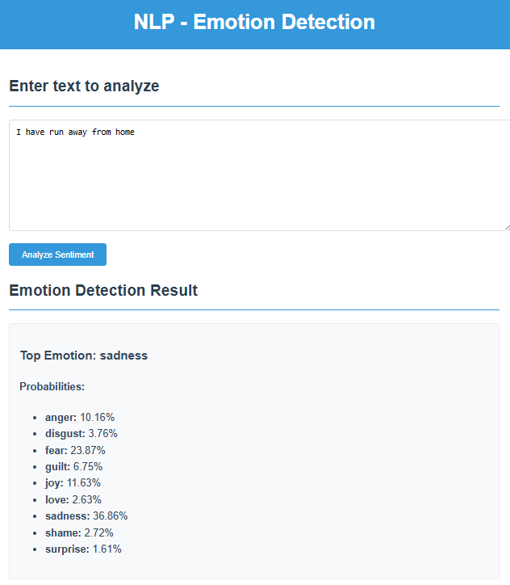
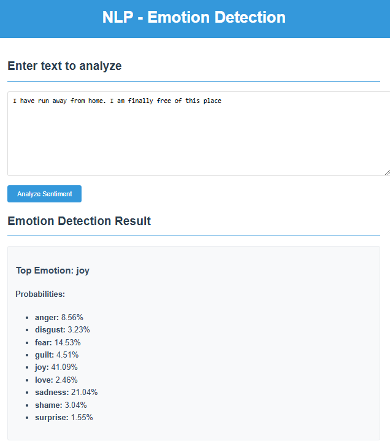

# Emotion Detection in Text

## Project Overview
This project implements an emotion detection system that analyzes text input and predicts the associated emotions. The system utilizes a machine learning model trained on various datasets containing text samples and their corresponding emotional labels.

## Model
The emotion detection model is built using a combination of natural language processing (NLP) techniques and machine learning algorithms. It processes the input text, splits it into sentences, and predicts the probabilities of different emotions for each sentence. The model then aggregates these probabilities to determine the overall emotion for the entire text.

### Training
The model is trained using a Jupyter Notebook, which can be found in the `src/model` directory. The notebook includes data loading, preprocessing, model training, and evaluation steps. You can explore the notebook to understand the training process and the datasets used.

## Deployment
The server for running application is deployed on Render, a cloud platform that allows for easy deployment of web applications. The FastAPI framework is used to create the API endpoints for the emotion detection service. You can view the webpage from the hosted page on github pages.

*Note, since the server is deployed on a free serverless platform, it requires a cold start and can be quite slow. Local deployment is much quicker to run.*

## Usage
To use the emotion detection service, you can access the web interface at [https://xeth-0.github.io/emotion_detection_text/]. It can classify both single sentences or paragraphs and outputs the detected emotion and the probabilities for that prediction.

## Web Page
You can find the web page for this project hosted on GitHub Pages at: [https://xeth-0.github.io/emotion_detection_text/].

## License
This project is licensed under the MIT License.
